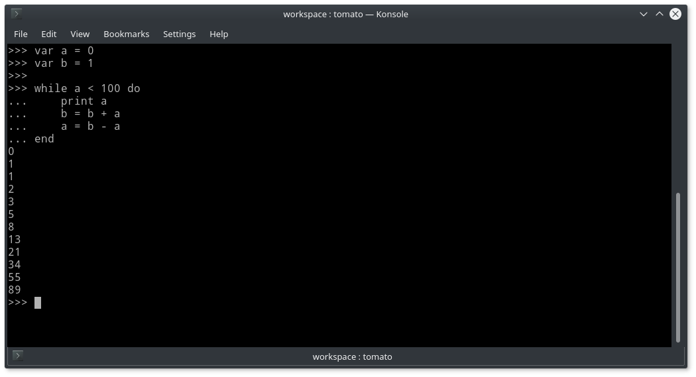

================================================================================
                                     Tomato
================================================================================

**Tomato** is a general purpose programming language.

Language
========

General Language Description
----------------------------

Every programm consist of statements. Valid statements are:

- Print statement (``print <expression>``);
- Expression;
- Variable declaration;
- Assignment;
- Control flow statement.

Variables & Type System
-----------------------

**Tomato** language is statically and strongly typed, i.e. once variable was
declared, its type can't be changed and only values of that type can be
assigned to variable.

Variables must be declared only once and can't be used until declared.
Variable's type is implicitly inferred and is same as initial value's type.

Declaration looks like: ::

    var <name> = <expression>

Assignment: ::

    <name> = <expression>

Note that assignment is not an expression.

Numerical Operations
--------------------

There are simple rules for deducting numerical types:

- Binary operation on integer and float produces float;
- Division produces float;
- Division by 0 is an error.
- Float exponent with negative base is an error;
- Negative integer exponent with an integer base is an error;

Expressions & Operators
-----------------------

Expression can consist of literals, variables, binary and unary
operators and nested expressions (using parentheses)

Supported operators are:

- Algebraic (``+``, ``-``, ``*``, ``/``, ``^``)
- Comparative (``==``, ``!=``, ``>``, ``>=``, ``<``, ``<=``)
- Boolean (``not``, ``and``, ``or``)

All operators are left-associative, except exponentiation (``^``) which is right-associative.

Operator ``not`` is unary. ``+`` and ``-`` can be both unary and binary depending on their position.

Expressions are evaluated according to next operator precedence:

1. ``^``
2. ``*`` and ``/``
3. unary ``+``, ``-`` and ``not``
4. ``+`` and ``-``
5. ``==``, ``!=``, ``>``, ``>=``, ``<``, ``<=``
6. ``and``
7. ``or``

Control Flow Statements
-----------------------

Both ``if`` and ``while`` define local name scope, so variables can be defined inside their bodies but not available after the ``end`` of body bock.

If-Then-Else
''''''''''''

Condition must be boolean expression. Alternative ``else`` branch is optional.
For now ``else-if`` branches are not supported, but nested statements works fine.

Shorten form: ::

    if <condition> then
        [statements]
    end

Full form: ::

    if <condition> then
        [statements]
    else
        [statements]
    end

While-Do
''''''''

Condition must be boolean expression: ::

    while <condition> do
        [statements]
    end

Interpreter Building
====================

Build using CMake, C++17 support is required: ::

    $ mkdir cmake-build
    $ cd cmake-build
    $ cmake ..
    $ cmake --build .
    $ ./src/tomato

Third-Party libraries
---------------------

GNU readline library is used for interactive command-line interface.
